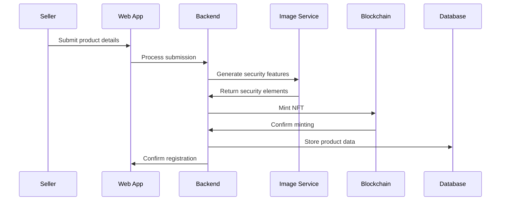
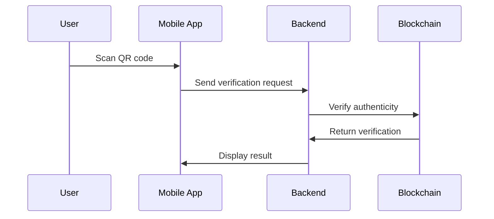
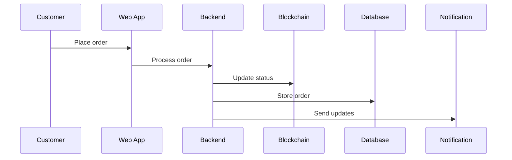
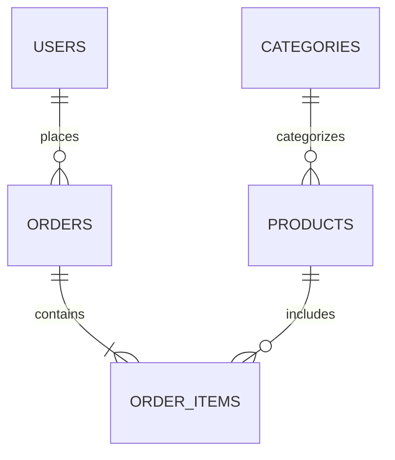

# Comprehensive System Architecture Documentation

## Executive Summary

Our supply chain management platform represents a sophisticated integration of blockchain technology, web applications, and mobile solutions. The system is designed to provide end-to-end product verification, secure supply chain management, and transparent tracking capabilities. This document provides a detailed overview of the system's architecture, components, and their interactions.

## Core Components Architecture

### 1. Web Application Architecture

#### Frontend Implementation
- **Framework**: React.js 18+
  - Virtual DOM for efficient rendering
  - Component-based architecture
  - Custom hooks for shared logic

- **State Management**: Redux
  - Centralized state store
  - Action creators for state modifications
  - Thunk middleware for async operations
  - Selectors for efficient data access

- **UI Components**:
  - Tailwind CSS for styling
  - Responsive design principles
  - Custom component library
  - Material-UI integration

#### Key Frontend Features
1. **Seller Dashboard**:
   - Real-time sales analytics
   - Inventory management interface
   - Order processing system
   - Product catalog management
   - Blockchain transaction monitoring

2. **Admin Panel**:
   - User management system
   - System configuration interface
   - Analytics dashboard
   - Role management
   - Audit logging interface

3. **Blockchain Integration**:
   - Web3.js integration
   - NFT management interface
   - Transaction monitoring
   - Gas fee estimation
   - Contract interaction UI

### 2. Backend Service Architecture

#### Server Implementation
- **Framework**: Express.js
  - RESTful API design
  - Middleware architecture
  - Route handlers
  - Error handling middleware

- **Database Layer**:
  - PostgreSQL 13+
  - Sequelize ORM
  - Migration system
  - Model relationships
  - Query optimization

#### Core Services

1. **Authentication Service**:
   ```
   ├── JWT token generation
   ├── Refresh token mechanism
   ├── Role-based access control
   ├── Session management
   └── Security middleware
   ```

2. **Product Service**:
   ```
   ├── Product creation
   ├── Inventory management
   ├── Category management
   ├── Price management
   └── Product verification
   ```

3. **Order Service**:
   ```
   ├── Order processing
   ├── Status management
   ├── Payment integration
   ├── Shipping integration
   └── Order history
   ```

4. **Blockchain Service**:
   ```
   ├── Smart contract interaction
   ├── Transaction management
   ├── Event listening
   ├── Gas optimization
   └── Error handling
   ```

### 3. Blockchain Layer Architecture

#### Smart Contract Structure

1. **ProductNFT Contract**:
   ```solidity
   contract ProductNFT {
       // Core functionality
       - Minting mechanism
       - Token metadata
       - Transfer restrictions
       - Ownership tracking
       
       // Security features
       - Access control
       - Pausable operations
       - Emergency functions
       
       // Events
       - Minting events
       - Transfer events
       - Status updates
   }
   ```

2. **SupplyChain Contract**:
   ```solidity
   contract SupplyChain {
       // Product management
       - Status tracking
       - Ownership changes
       - Verification system
       
       // Role management
       - Manufacturer roles
       - Distributor roles
       - Retailer roles
       
       // Supply chain operations
       - Product registration
       - Status updates
       - Verification checks
   }
   ```

#### Blockchain Features

1. **Product Tokenization**:
   - Unique NFT generation
   - Metadata storage
   - Token standards compliance
   - Transfer restrictions

2. **Supply Chain Tracking**:
   - Status updates
   - Ownership transfers
   - Location tracking
   - Timestamp recording

3. **Access Control**:
   - Role-based permissions
   - Multi-signature operations
   - Administrative controls
   - Emergency procedures

### 4. Image Processing Service Architecture

#### Service Components

1. **UV Hologram Generation**:
   ```python
   class HologramGenerator:
       # Generation methods
       - create_hologram()
       - apply_security_features()
       - optimize_image()
       - validate_output()
       
       # Security features
       - watermarking
       - encryption
       - compression
       - validation
   ```

2. **Image Processing Pipeline**:
   ```
   ├── Input validation
   ├── Image preprocessing
   ├── Feature extraction
   ├── Security application
   ├── Quality assurance
   └── Output generation
   ```

#### Security Features

1. **Hologram Security**:
   - UV-reactive elements
   - Micro-text integration
   - Dynamic patterns
   - Encrypted features

2. **Verification System**:
   - Pattern recognition
   - Feature extraction
   - Authenticity validation
   - Security check

### 5. Mobile Application Architecture

#### Application Structure

1. **Core Components**:
   ```
   ├── Authentication
   ├── Product Scanner
   ├── Verification System
   ├── Order Management
   └── Profile Management
   ```

2. **Technical Implementation**:
   - Native Android development
   - Kotlin/Java implementation
   - Material Design
   - Custom UI components

#### Key Features

1. **QR Scanner**:
   - Camera integration
   - Code recognition
   - Error handling
   - Result processing

2. **Verification System**:
   - Blockchain verification
   - Local validation
   - Security checks
   - Result display

## Data Flow Architecture

### 1. Product Registration Flow



### 2. Product Verification Flow



### 3. Order Processing Flow



## Database Architecture

### 1. Schema Design

#### Users Table
```sql
CREATE TABLE users (
    id SERIAL PRIMARY KEY,
    username VARCHAR(255) NOT NULL,
    email VARCHAR(255) UNIQUE NOT NULL,
    password_hash VARCHAR(255) NOT NULL,
    role VARCHAR(50) NOT NULL,
    created_at TIMESTAMP DEFAULT CURRENT_TIMESTAMP,
    updated_at TIMESTAMP DEFAULT CURRENT_TIMESTAMP
);
```

#### Products Table
```sql
CREATE TABLE products (
    id SERIAL PRIMARY KEY,
    name VARCHAR(255) NOT NULL,
    description TEXT,
    price DECIMAL(10,2) NOT NULL,
    stock INTEGER NOT NULL,
    category_id INTEGER REFERENCES categories(id),
    nft_token_id VARCHAR(255),
    created_at TIMESTAMP DEFAULT CURRENT_TIMESTAMP,
    updated_at TIMESTAMP DEFAULT CURRENT_TIMESTAMP
);
```

#### Orders Table
```sql
CREATE TABLE orders (
    id SERIAL PRIMARY KEY,
    user_id INTEGER REFERENCES users(id),
    status VARCHAR(50) NOT NULL,
    total_amount DECIMAL(10,2) NOT NULL,
    created_at TIMESTAMP DEFAULT CURRENT_TIMESTAMP,
    updated_at TIMESTAMP DEFAULT CURRENT_TIMESTAMP
);
```

### 2. Relationships



## API Architecture

### 1. RESTful Endpoints

#### Authentication API
```
POST   /api/auth/login
POST   /api/auth/register
POST   /api/auth/refresh
DELETE /api/auth/logout
```

#### Products API
```
GET    /api/products
POST   /api/products
GET    /api/products/:id
PUT    /api/products/:id
DELETE /api/products/:id
```

#### Orders API
```
GET    /api/orders
POST   /api/orders
GET    /api/orders/:id
PUT    /api/orders/:id/status
```

#### Verification API
```
POST   /api/verify/product
GET    /api/verify/status/:id
POST   /api/verify/hologram
```

### 2. WebSocket Architecture

#### Connection Management
```javascript
class WebSocketManager {
    // Connection handling
    - initialize()
    - handleConnection()
    - handleDisconnection()
    
    // Message handling
    - processMessage()
    - broadcastUpdate()
    - sendPrivateMessage()
    
    // Error handling
    - handleError()
    - reconnect()
}
```

#### Event Types
1. Order Updates
2. Status Changes
3. Verification Results
4. System Notifications

## Security Architecture

### 1. Authentication System

#### JWT Implementation
```javascript
class JWTManager {
    // Token management
    - generateToken()
    - verifyToken()
    - refreshToken()
    
    // Security features
    - validatePayload()
    - handleExpiration()
    - revokeToken()
}
```

### 2. Role-Based Access Control

#### Permission Levels
```
├── Admin
│   ├── Full system access
│   ├── User management
│   └── Configuration control
├── Seller
│   ├── Product management
│   ├── Order processing
│   └── Analytics access
└── Customer
    ├── Order placement
    ├── Product viewing
    └── Profile management
```

## Development Environment

### 1. Local Setup

#### Requirements
```
├── Node.js 16+
├── Python 3.8+
├── PostgreSQL 13+
├── Hardhat
└── Android Studio
```

#### Configuration
```
├── Environment variables
├── Database configuration
├── Blockchain network setup
└── Development servers
```

### 2. Testing Infrastructure

#### Test Suites
```
├── Unit tests
├── Integration tests
├── End-to-end tests
└── Contract tests
```

## Deployment Architecture

### 1. Production Environment

#### Server Configuration
```
├── Load balancer
├── Application servers
├── Database clusters
└── Cache servers
```

#### Scaling Strategy
```
├── Horizontal scaling
├── Vertical scaling
├── Cache optimization
└── Database sharding
```

## Monitoring and Maintenance

### 1. System Monitoring

#### Metrics Collection
```
├── Performance metrics
├── Error tracking
├── User analytics
└── System health
```

#### Alert System
```
├── Error notifications
├── Performance alerts
├── Security alerts
└── System status
```

### 2. Maintenance Procedures

#### Regular Maintenance
```
├── Database optimization
├── Cache clearing
├── Log rotation
└── Security updates
```

#### Backup Strategy
```
├── Database backups
├── File backups
├── Configuration backups
└── Recovery procedures
```

## Future Considerations

### 1. Scalability Improvements

#### Planned Enhancements
```
├── Microservices architecture
├── Enhanced caching
├── Database optimization
└── Load distribution
```

### 2. Feature Expansion

#### Upcoming Features
```
├── Advanced analytics
├── AI integration
├── Enhanced security
└── Mobile expansion
```

## Conclusion

This comprehensive architecture provides a robust foundation for our supply chain management platform. The system's modular design, combined with blockchain technology and sophisticated security measures, ensures scalability, security, and reliability. Regular updates and maintenance procedures keep the system operating at peak efficiency while allowing for future expansion and enhancement.