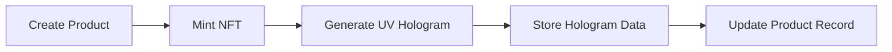
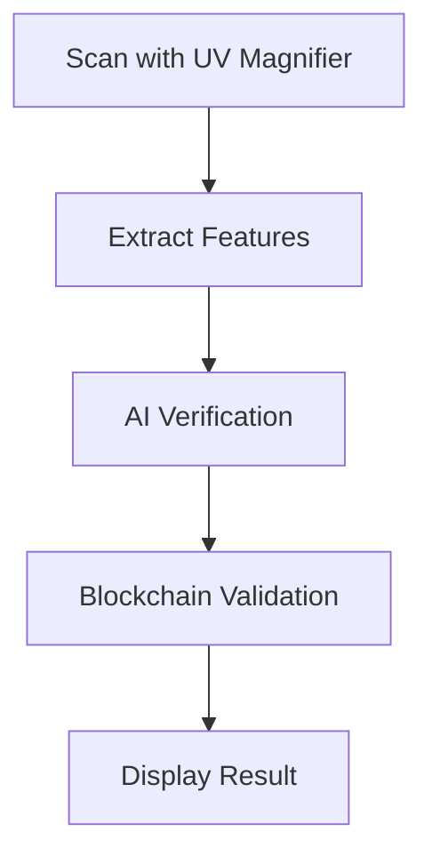

# UV Hologram Verification System

## Overview
The UV hologram verification system combines physical security features with digital verification through NFT token IDs. Each product has a unique UV-sensitive hologram that contains embedded product information and NFT token ID, only visible under UV light through a specialized magnifying glass with AI verification capabilities.

## Components

### 1. UV Hologram Generation
- Generated per product during NFT minting
- Contains:
  - Product NFT token ID (UV-visible layer)
  - Store verification data
  - AI-verifiable patterns
  - Product-specific information

### 2. Mobile Verification Device
Requirements for the magnifying glass device:
- UV light source (395-400nm wavelength)
- High-resolution camera
- On-device AI processing capabilities
- Secure communication channel with the blockchain

### 3. AI Verification System
The on-device AI system performs:
1. Hologram Pattern Recognition
   - Detects and validates hologram security features
   - Extracts embedded NFT token ID
   - Verifies hologram authenticity

2. NFT Verification
   - Queries blockchain with extracted token ID
   - Validates product authenticity
   - Verifies ownership chain

## Implementation Guidelines

### Mobile App Integration
1. Camera Access
```kotlin
// Request camera and UV light permissions
<uses-permission android:name="android.permission.CAMERA" />
<uses-permission android:name="android.permission.FLASHLIGHT" />
```

2. UV Light Control
```kotlin
// Enable UV light during scanning
private fun enableUVLight() {
    cameraManager.setTorchMode(cameraId, true)
    // Set UV wavelength to 395-400nm
}
```

3. AI Model Integration
```kotlin
// Load TensorFlow Lite model for hologram verification
private val interpreter = Interpreter(loadModelFile())

// Process image frame
fun processFrame(frame: Bitmap): VerificationResult {
    // 1. Extract UV-visible elements
    val uvLayer = extractUVLayer(frame)
    
    // 2. Detect and validate hologram patterns
    val patterns = detectPatterns(uvLayer)
    
    // 3. Extract and verify NFT token ID
    val tokenId = extractTokenId(patterns)
    
    // 4. Verify against blockchain
    return verifyWithBlockchain(tokenId)
}
```

### Security Considerations
1. Physical Security
   - UV-sensitive ink with specific wavelength response
   - Multi-layer holographic patterns
   - Micro-text and hidden features

2. Digital Security
   - Encrypted communication with blockchain
   - Secure storage of verification results
   - Rate limiting for verification attempts

### Error Handling
```kotlin
sealed class VerificationError {
    object InvalidHologram : VerificationError()
    object TokenMismatch : VerificationError()
    object NetworkError : VerificationError()
    data class AIProcessingError(val message: String) : VerificationError()
}
```

## Integration with Existing Systems

### 1. Product Creation Flow


### 2. Verification Flow


## Best Practices
1. Regular AI Model Updates
   - Keep verification models up to date
   - Add new security feature detection
   - Improve accuracy over time

2. Monitoring and Analytics
   - Track verification attempts
   - Monitor success/failure rates
   - Detect unusual patterns

3. User Experience
   - Clear scanning instructions
   - Quick verification process
   - Detailed error messages

## Testing Guidelines
1. Physical Tests
   - UV light sensitivity
   - Pattern visibility
   - Durability testing

2. Software Tests
   - AI model accuracy
   - Blockchain integration
   - Error handling

3. Security Tests
   - Forgery attempts
   - Network security
   - Rate limiting

## Troubleshooting
Common issues and solutions:
1. Poor UV Light Conditions
   - Ensure proper UV wavelength
   - Check ambient lighting
   - Verify device capabilities

2. Recognition Failures
   - Clean magnifying glass
   - Update AI model
   - Check hologram condition

3. Blockchain Verification Issues
   - Verify network connection
   - Check token ID format
   - Validate contract addresses